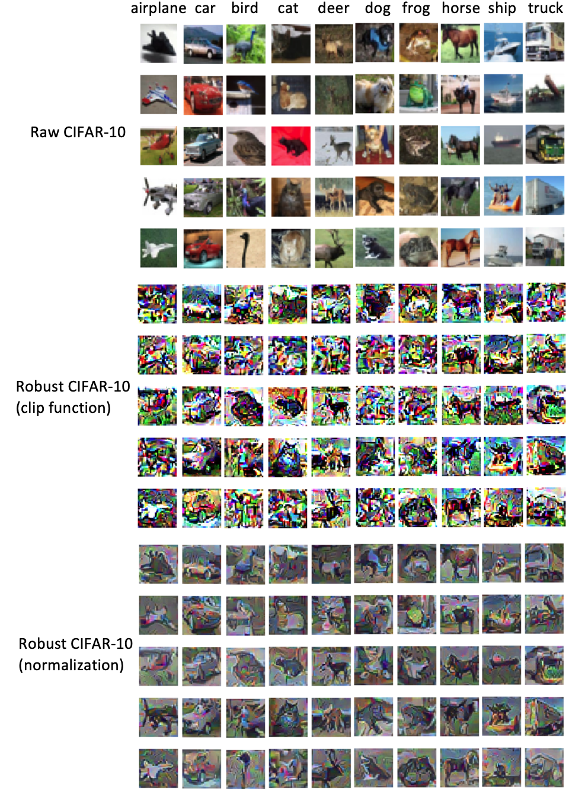

# robust_nonrobust_features_cifar10

This is a reproduction work of *"Adversarial Examples Are Not Bugs, They Are Features"* by [Madry's lab](https://github.com/MadryLab/constructed-datasets)

### Codes:

1. cifar_input.py: contains two classes for data input. CIFAR10_RAW is to input raw CIFAR-10, CIFAR10_Augmented input raw CIFAR-10 then do augmentation
2. model.py: contains the ResNet model architecture
3. attacks.py: contains two PGD attack approaches. perturb_inf_v2 is l-inf PGD attack. perturb_l2_v2 is l-2 PGD attack.
4. train_util_linf.py: contains the training process of using l-inf PGD attack
5. train_util_l2.py: contains the training process of using l-2 PGD attack
6. main_baseline.py: the main function of training the baseline model. Run this code to generate the the baseline model.
7. main_adv_l2.py: the main function of tranining the l-2 PGD adversarial model. Run this code to generate the the l-2 PGD adversarial model.
8. main_adv_linf.py: the main function of tranining the l-inf PGD adversarial model. Run this code to generate the the l-inf PGD adversarial model.
9. robust_features.py: run this code to generate robust CIFAR-10
10. train_on_robust_feat.py: run this code to train a model on the robust CIFAR-10
11. test.py: contains testing process for clean test and adversarial test. Run this code to test models.

### Models:
1. std_model_50.pt: the baseline model
2. adv_model_50_l2.pt: the l-2 PGD adversarial trained model
3. adv_model_50_linf.pt: the l-inf PGD adversarial trained model
4. r_model_clip.pt: the model trained on the robust CIFAR-10 generated by using the clip function
5. r_model_norm.pt: the model trained on the robust CIFAR-10 generated by using the normalization function

**Models trained on nature CIFAR10**

Baseline Model

Architecture: ResNet-50 
Epoch: 100 
Lr = 0.1 
Decay boundaries: 50% and 75% epoch
Decay rate: 0.1 
Weight decay: 0.0005

L2-PGD Attack

|eps|alpha|iter|
|---|-----|----|
|0.5|0.1|7|

Linf-PGD Attack

|eps|alpha|iter|
|---|-----|----|
|0.03|0.008|7|

|Model|Clean Accuracy|Adv Accuracy (L2-PGD Attack (eps=0.25))|
|-----|--------------|------------|
|Baseline Model|91.72%|3.87%|
|Adv Trained model(L-2)|83.83%|74.51%|
|Adv Trained model(L-inf)|78.57%|69.53%|

**Models trained on robust CIFAR10**

|Model|Clean Accuracy|Adv Accuracy (L2-PGD Attack (eps=0.25))|
|-----|--------------|------------|
|Trained on standard set|91.72%|3.87%|
|Trained on robust set (clip function)|60.48%|34.47%|
|Trained on robust set (normalization)|73.55%|45.38%|

**Robust CIFAR10 Samples**

